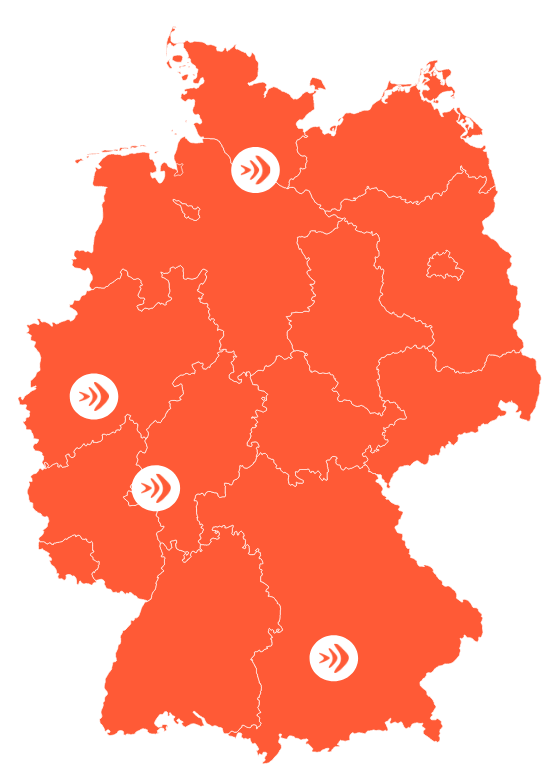

<!-- _class: big-headline granite -->

Welcome to
Afterwork Coding

---

<!-- _class: intro-slide granite -->

mit Andrea und Julia

---

# Was wir heute machen

erstellen einer virtuellen Postkarte mit HTML und CSS

- VorstellungsRunde

- What are we doing at Neuefische?
- kleines Intro HTML und CSS
- Coding!

---

<!-- _class: image-profile -->

## Andrea und Julia

Coach für Web Development bei Neuefische

---

<!-- class: section intro-->

# Wer ist Neue Fische?

 neuefische - School for digital Talent

- 5  Bootcamps (Web, Java, Data Science, Data Analytics, AWS)

- mehr als 20  Coaches
- rund 100  Partnerunternehmen
- 4  Standorte (Hamburg, Köln, München und Frankfurt + remote)
- mehr als 900  Absolvent:innen
- 92%  Jobchancen am Arbeitsmarkt\*

---

# Web-Development Bootcamp

- 8  Wochen Lerninhalte (HTML, CSS, JS, React, Node uvm.)
- 4  Wochen eigenes Abschlussprojekt

---

# Was ist Frontend?

- Frontend = sichtbare Teile der Website /der Applikation
  der Bereich, den der Nutzer sehen kann und mit interagieren kann

- Backend = nicht sichtbare Teil, zB. Server, serverseitige Anwendungen und Datenbank

---

# Was macht eigentlich eine Frontend Entwicklerin ?

- Webapplikation werden designtechnisch und funktional umgesetzt

- Wir kümmern uns um Usability und Performance
- das Programm muss auf allen Geräte und Bildschirmgrößen funktionieren

---

## was ist Web Entwicklung

---

## HTML

- wie man HTML Schreibt und was wir brauchen

---

## CSS

- wie man css schreibt

---

## CODING!!!
