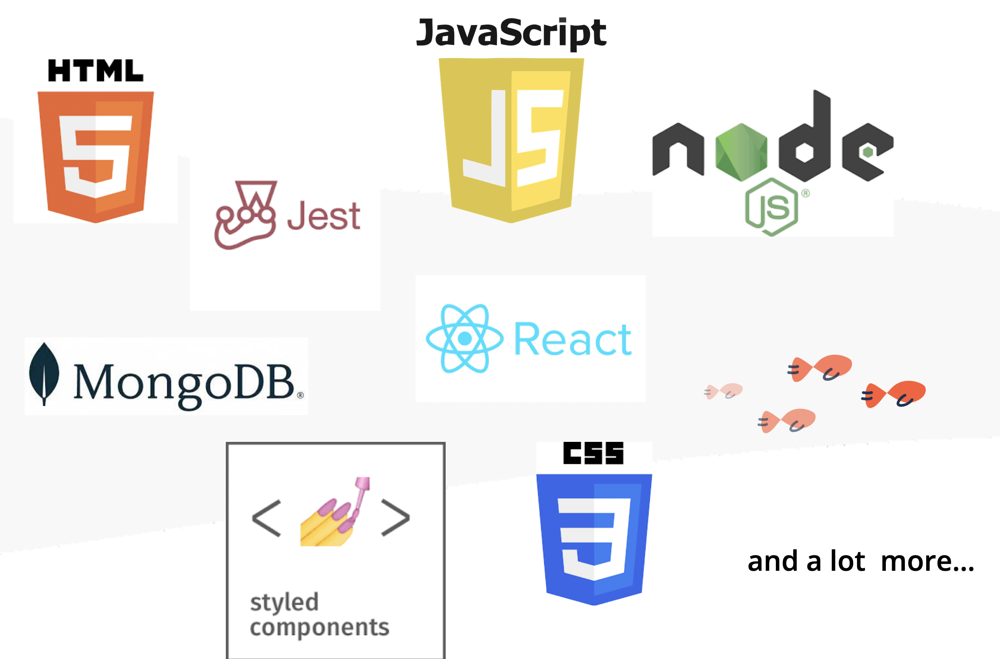
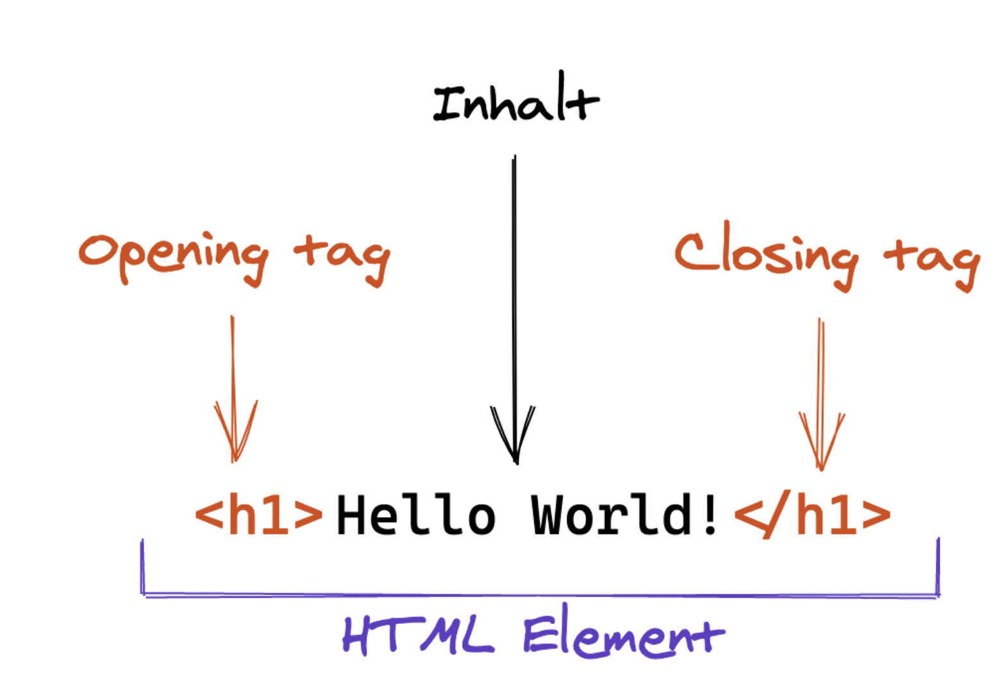
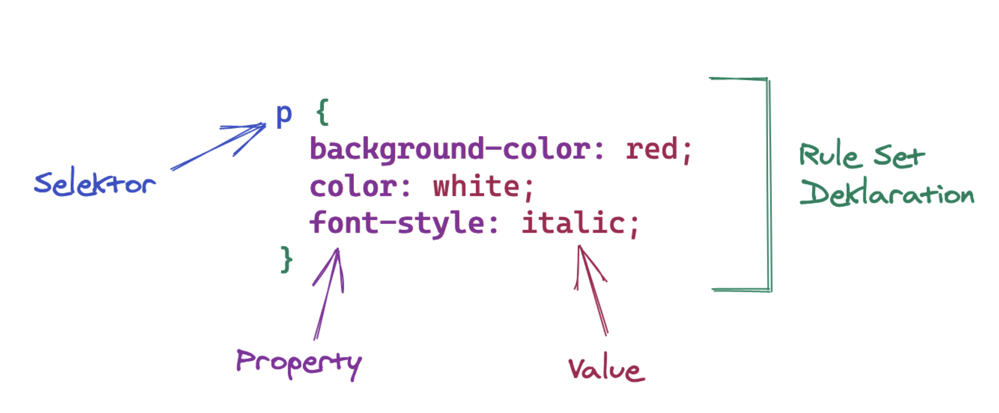

<!-- _class: big-headline granite -->

Welcome to
After-Work-Coding

---

<!-- _class: intro-slide granite -->

mit Andrea und Julia

---

# Was machen wir heute?

<!-- _class: list -->

- Vorstellungsrunde

- Was macht **neue fische**
- kleines Intro HTML und CSS
- Coding!
   → eine virtuelle Postkarte mit HTML und CSS 

---

<!-- _class: image-profile -->

## Andrea und Julia

Coach für Web Development bei **neue fische**

---

<!-- class: section intro-->

# Was machen wir?

 neue fische - School and Pool for Digital Talent

- 5  Bootcamps
  (Web Development, Java Development, Data Science, Data Analytics, Cloud Development)

- mehr als 29  Coaches
- 71  Partnerunternehmen
- 5  Standorte
  (Hamburg, Köln, München, Frankfurt, Bochum und remote)
- mehr als 900  Absolvent:innen
- 92%  Jobchancen am Arbeitsmarkt\*

---

<!-- class: section webbootcamp-->

# Web Development Bootcamp

- 8  Wochen Lerninhalte
- 4  Wochen eigenes Abschlussprojekt
  

---

<!-- class: section intro-->

# Was ist Frontend?

## Frontend

- sichtbare Teile der Website /der Applikation
- der Bereich, den der Nutzer sehen und damit interagieren kann

## Backend

- nicht sichtbarer Teil, zB. Server, serverseitige Anwendungen und Datenbanken

---

<!-- class: section developer-->

# Was macht eigentlich ein:e Frontend-Entwickler:in ?

- Webapplikationen werden designtechnisch und funktional umgesetzt

- Wir kümmern uns um Usability und Performance
- das Programm muss auf allen Geräten und Bildschirmgrößen funktionieren (responsive)

 

---

<!-- class: section imgcenter -->

# Was ist Web Entwicklung?

---

# HTML - Syntax

---

<!-- class: section html -->

# HTML - Tags für unser Projekt

- `<section>`
- `<h1>Hello world</h1>`
- ``
- `
Text
`
- ` another text`

---

<!-- class: section imgcenter -->

# CSS - Syntax

---

<!-- _class: big-headline granite -->

lets dive into coding!
